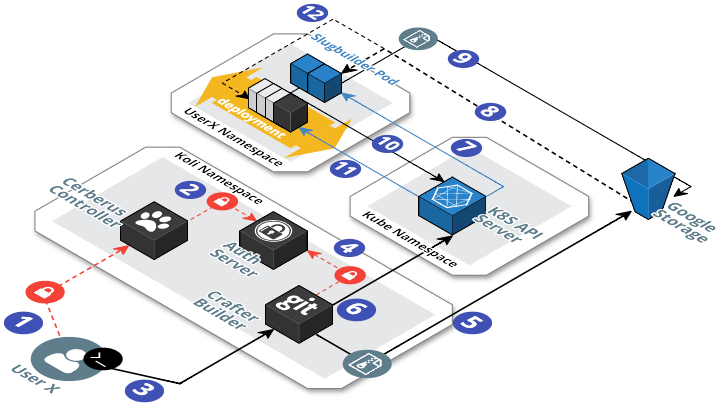

# Koli GIT Build Flow



1. The user provides credentials to authenticate on the plataform through `Cerberus`. 

	```bash
	$ koli login
	Enter your Koli credentials.
	Email:
	```

2. `Cerberus` asks to `Auth Server` if the credentials provided are correct and returns
a token.

	> The token is stored in a config file until it's no longer valid.

3. The user executes a `git push` to start the build process on `Crafter`.

	```bash
	$ git push koli master
	```

4. The token is sent through an HTTP request with [Basic Authentication](https://en.wikipedia.org/wiki/Basic_access_authentication), 
which is validated on the `Auth Server`.
5. The hook push generates a new folder (in the filesystem) containing the 
user X repository on `Crafter`, the path is prefixed in the 
following order: `clusterID/customerID/userNamespace/userRepository`.
The content is compressed and sent to an object store (Minio/S3/Google Storage,etc).
6. The [pre-receive hook](https://git-scm.com/docs/githooks#pre-receive) is executed as a 
Golang binary (`gitreceiver`) which creates a new `POD` with all the necessary
information to start the build process.

	> Throughout the process the user could watch everthing the build is performing.
	> From this point forward the build is decouped from `Crafter`.

7. Kubernetes tries to start the `POD` in the User Namespace.
8. The `slugbuilder container` downloads the tarball repository and starts the
compilation of the source code from a specific buildpack to a slug file tarball.
9. A new release is generated and the tarball slug file is sent to the object storage.
10. When a build is succesfully completed it triggers a HTTP request to the `deployer sidecar container`,
updating the deployment object with the information about the slug file tarball.
11. The state is replicated on the node and the deployment is resumed.
12. The `POD` is started and the `slugrunner container` downloads the slug file tarball and starts
accordingly with the `Procfile` process type.