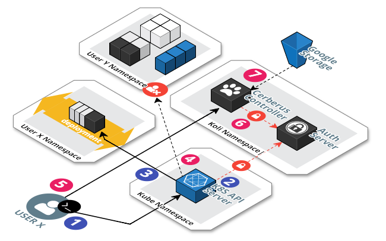

# Koli CLI Perspective



1) The `user X` creates a new deployment.

```bash
$ koli create deploy backend-app
```

2) The api-server validates the `authentication` and `authorization` delegating to `Auth Server`.
For each process it sends a webhook, thus for every command two webhooks are sent 
to the `Auth Server`.
3) The deployment object is created and carried on the changes to the node on the User X Namespace.
4) On a hypotetical situation the user tries to manage the User Y Namespace and it's denied by the response
of the `Auth Server` in the `authorization` webhook.
5) The User X tries to list his releases.
6) The `Auth Server` verifies the credentials are correct and if he is authorized to list the contents. 
7) The list of releases are retrieved from the object store.